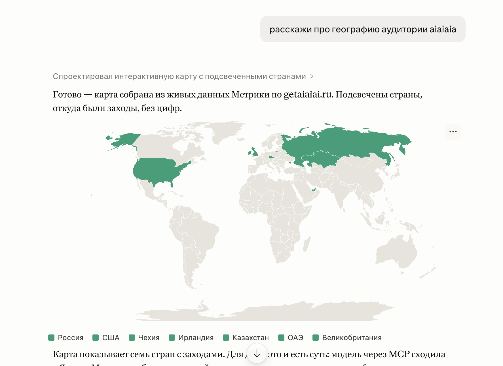

# yandex-metrika-mcp

[](https://opensource.org/licenses/MIT)
[](https://www.python.org/)
[](https://github.com/jlowin/fastmcp)
[](https://modelcontextprotocol.io)

Query **Yandex Metrika** analytics in plain language, right inside Claude. "How many visits this week?", "Top traffic sources for June", "Mobile share today?" — the assistant queries Metrika and answers directly. No dashboards, no SQL, no API keys to manage.

Open-source by [aiaiai](https://getaiaiai.ru) — we build what we teach.

---

Задавай вопросы по **Яндекс.Метрике** обычным языком прямо в Claude. «Сколько визитов за неделю?», «топ источников за июнь», «доля мобильных?» — ассистент сам сходит в Метрику и ответит. Без дашбордов.



## Works with

Claude.ai &nbsp;·&nbsp; Claude Code &nbsp;·&nbsp; Claude Desktop &nbsp;·&nbsp; Cursor &nbsp;·&nbsp; any MCP-compatible client

## Connect in one minute (hosted)

No installation needed — connect to the hosted service.

**Claude.ai** (Settings → Connectors → Add):
```
https://mcp.getaiaiai.ru/yandex-metrika
```
Click **Connect** → sign in with Yandex → allow access.

**Claude Code CLI:**
```bash
claude mcp add --transport http yandex-metrika https://mcp.getaiaiai.ru/yandex-metrika/
claude mcp login yandex-metrika
```
A browser window opens → sign in with Yandex → done. On headless/SSH: add `--no-browser` to `mcp login` and paste the redirect URL when prompted.

**Claude Desktop / Cursor** — add to `mcpServers`:
```json
{
  "mcpServers": {
    "yandex-metrika": {
      "type": "http",
      "url": "https://mcp.getaiaiai.ru/yandex-metrika/"
    }
  }
}
```

No app registration, no tokens to manage. **Read-only** — the service never writes to your Metrika account.

<details>
<summary>Подключение на русском</summary>

**Claude.ai** (Настройки → Коннекторы → Добавить):
```
https://mcp.getaiaiai.ru/yandex-metrika
```
Нажмите **Подключить** → войдите через Яндекс → разрешите доступ.

**Claude Code CLI:**
```bash
claude mcp add --transport http yandex-metrika https://mcp.getaiaiai.ru/yandex-metrika/
claude mcp login yandex-metrika
```
Откроется браузер → войти через Яндекс → готово.

</details>

## Tools

| Tool | Description |
|------|-------------|
| `list_counters` | List all Yandex Metrika counters available to the token (id, name, site) |
| `query` | Run a Reporting API query — visits, users, pageviews, bounce rate, traffic sources, devices, geography, UTMs, and more |

### `query` parameters

| Parameter | Default | Description |
|-----------|---------|-------------|
| `counter_id` | required | Counter ID from `list_counters` |
| `metrics` | required | Comma-separated metrics, e.g. `ym:s:visits,ym:s:users` |
| `dimensions` | — | Group-by fields: `ym:s:date`, `ym:s:lastTrafficSource`, `ym:s:deviceCategory`, … |
| `date1` / `date2` | `7daysAgo` / `today` | Date range: `YYYY-MM-DD` or relative (`today`, `yesterday`, `NdaysAgo`) |
| `filters` | — | Filter expression, e.g. `ym:s:deviceCategory=='mobile'` |
| `sort` | — | Sort field; prefix `-` for descending, e.g. `-ym:s:visits` |
| `limit` | `100` | Max rows returned |

Common metrics: `ym:s:visits`, `ym:s:users`, `ym:s:pageviews`, `ym:s:bounceRate`, `ym:s:avgVisitDurationSeconds`, `ym:s:newUsers`

Common dimensions: `ym:s:date`, `ym:s:lastTrafficSource`, `ym:s:startURL`, `ym:s:deviceCategory`, `ym:s:regionCountry`, `ym:s:lastsourceUTMSource`

---

## Self-host with your own token

<details>
<summary>For developers — run the engine locally with full control over your data.</summary>

Requires Python 3.10+ and [uv](https://docs.astral.sh/uv/).

```bash
git clone https://github.com/expremiental/yandex-metrika-mcp.git
cd yandex-metrika-mcp
uv sync
```

**Get a token.** Go to [oauth.yandex.ru](https://oauth.yandex.ru), create an app (platform: "Web services"), enable **Yandex Metrika → Read statistics** (`metrika:read`), then get an OAuth token:

```bash
export YANDEX_METRIKA_TOKEN="<your-token>"
```

**Connect** (Claude Desktop / Cursor — add to `mcpServers`):

```json
{
  "mcpServers": {
    "yandex-metrika": {
      "command": "uv",
      "args": ["run", "yandex-metrika-mcp"],
      "env": { "YANDEX_METRIKA_TOKEN": "<your-token>" }
    }
  }
}
```

**Run over HTTP:**
```bash
MCP_TRANSPORT=http PORT=8000 uv run yandex-metrika-mcp
# endpoint: http://localhost:8000/mcp
```

**Embed in your own backend.** The engine accepts an injectable async token resolver — wrap it with your own auth:

```python
from yandex_metrika_mcp import build_server

async def my_token_resolver() -> str:
    return "<metrika:read token>"

build_server(token_resolver=my_token_resolver).run(transport="stdio")
```

Public API: `build_server`, `YandexMetrikaClient`, `TokenResolver`, `env_token_resolver`, `main`.

</details>

## License

[MIT](LICENSE) · made by [aiaiai](https://getaiaiai.ru)
